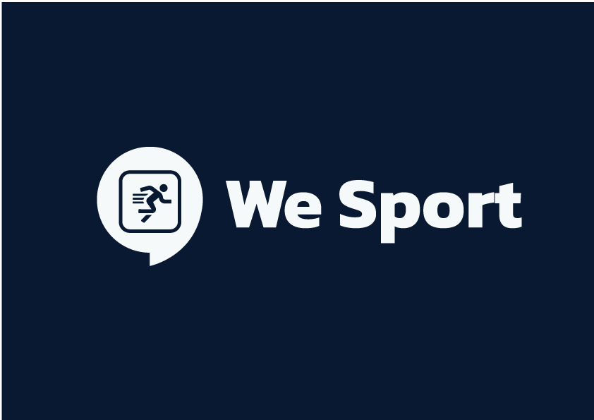

**👱‍♂️ Let's connect sporty !**

 

This is an school project for Efrei.
Application mobile basé sur React Native, qui permet de trouver des sportifs, ou de compléter votre équipe de sport pour une session.

## ⚙ Installation

1. Download or clone repository

2. Go to folder :
>`cd weSport`

3. Install dependicies :
> `yarn install`

4. Launch project :
> `yarn start`

## ✨Usage

* Application will be invoked by using the following command:
    `yarn start`

* Application will be build by using the following command:
    `yarn build`

## 🎉Features

- Loading page

- SwiperStarter Pages

- Register 

- Login

- Home

- Request from Meeting

- Add new Meeting

- Alarm about all Meeting

- Profile

## 🎩Sources

Backend (Spring) : https://github.com/SoufianLabed/We-sport_back

## 📚​ Documentation

React Native : https://reactnative.dev/docs/getting-started

Components : https://reactnative.dev/docs/components-and-apis

## 🔗​ Deployment

This project use Metro and Expo.
This project can be deployed in web browser, ios or android (and emulator).

U can use : Android/Ios Emulator Extension.

OR :
1. lauch Metro Building, 
2. run it in localhost
3. click "Run on Android device/emulator"
## ⌨ License
  
Licensed under the [MIT](LICENSE) license.

## 🎩Contributor

Soufian - Nahidath - Paul - Loic - Sami